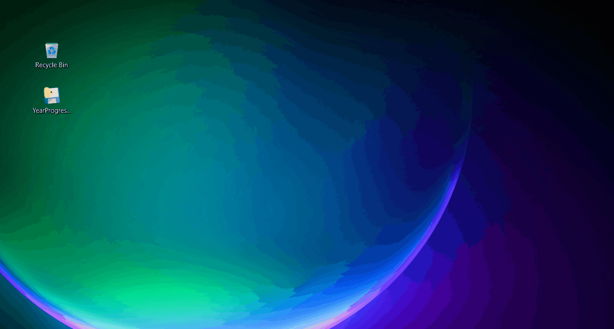

# Year Progress Widget

A minimal desktop widget for Windows that sits behind your desktop icons
and shows how much of the year is gone.

It uses PySide6 for the UI and some Win32 API hacks to attach the window
directly to the desktop wallpaper layer (WorkerW), so it doesn't get in
the way of your other windows.



## Features

-   **Pinned to Desktop:** Stays behind your icons but above the
    wallpaper.
-   **Acrylic/Glass Look:** Matches the Windows 11 aesthetic.
-   **Draggable:** Hold click to move it around.
-   **System Tray:** Right-click the icon in the taskbar to refresh or
    quit.
-   **High DPI Support:** Won't look blurry on 4K screens.

## Usage

### Running from source

You'll need Python installed.

#### Clone the repo:

``` bash
git clone https://github.com/ska2704/YearProgressWidget.git
cd YearProgressWidget
```

#### Install dependencies:

``` bash
pip install -r requirements.txt
```

#### Run it:

``` bash
python main.py
```

------------------------------------------------------------------------

### Using the executable

If you don't want to mess with Python, just download the `.exe` from the
Releases page.

## Run on Startup

To have this start automatically when you log in:

### The easy way:

1.  Press `Win + R`, type `shell:startup`, and hit Enter.
2.  Create a shortcut to `main.py` (or the `.exe`) and drag it into that
    folder.

### If that doesn't work:

Use **Task Scheduler**. Create a basic task that triggers **When I log
on** and starts the program.

**Note:**\
In the task properties, make sure to uncheck **"Stop the task if it runs
longer than 3 days"** or Windows will kill the widget eventually.

## How it works (The technical part)

This isn't just a borderless window. To keep it stuck to the background:

1.  The script finds the Windows Program Manager (`Progman`) handle.
2.  It sends the undocumented message `0x052C` to spawn a `WorkerW`
    layer.
3.  It reparents the Qt window to that layer using `ctypes`.

This is what allows desktop icons to sit on top of the widget while the
widget stays above the wallpaper.

## License

MIT License
